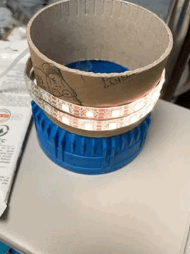

# LighthouseController

Leuchttrum Leuchtfeuer-Simulation per WS2812 LED.

## Beschreibung

Angesteuert werden WS2812 LEDs welche in Spalten oder Zeilen angeordnet sind.




## Setup
Im Programmcode können einige Einstellungen vorgenommen werden.

```
//-----------------------------------------------------------------------------
// ANFANG - Benutzereinstellungen
//-----------------------------------------------------------------------------

#define PIN               7   // Pin an welchem die WS2812 angeschlossen sind

#define LEDCOUNT          38  // Summe aller angeschlossenen LEDs
#define COLCOUNT          19  // Anzahl der Spalten (LEDs welche gleichzeitig angesteuert werden)

#define DIMCOLSBEFORE     2   // Anzahl der Spalten welche vor der Position gedimmt werden (Wert muss > 0 sein)
#define DIMCOLSAFTER      5   // Anzahl der Spalten welche nach der Position gedimmt werden (Wert muss > 0 sein)

bool ColMode = false;         // Spaltenmodus aktivieren, hierbei sind die Einzelnen Strips in Spalten angeordnet.
int Rpm = 40;                 // "Umdrehungen" je Minute

//-----------------------------------------------------------------------------
// ENDE - Benutzereinstellungen
//-----------------------------------------------------------------------------
```
